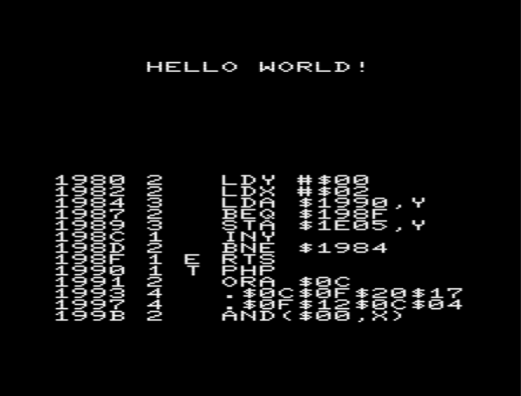

# TinyASM
 TINYASM is an assembler for an unexpanded VIC20, which can be loaded directly from disk without a module or memory expansion.

 The whole project is separated to have as much free memory as possible for programming. 
 That is why only the most essential comfort features are implemented.

The free area for your code is from $18a7 to $1dff = 1368 bytes or
$1973 to $1dff in the tape version.

## it is necessary to have seen the video to be able to fully operate the assembler

**here again a quick overview of all functions**
* .D - delete line
* .I$0a - insert 10 Bytes (255 max)
* .J$1A00 - jump to address or .J$Mn label $Mn
* .L“NAME“,8 - load program
* .S“NAME“,8 - save program
* .B - switches between code and byte view
* .T“ABCD…“ - insert text
* .$01$02$03... - enter bytes directly
* .Mn – (simple) memory labels - it's better to watch the video for this
* F1 – start your code

enjoy!
